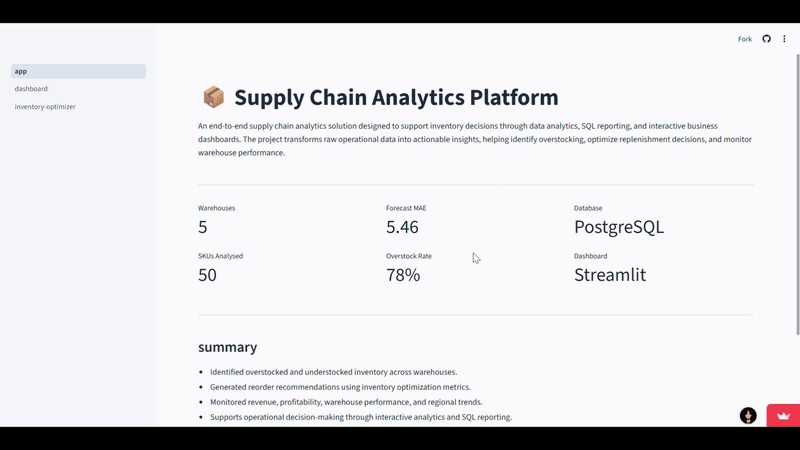

# Supply Chain Analytics & Inventory Optimization

 An end-to-end supply chain analytics solution that identifies inventory inefficiencies, prioritizes high-value products using ABC-Pareto analysis, automates inventory replenishment decisions, and delivers a cloud-hosted interactive dashboard with an automated ETL pipeline for continuous reporting.

---

## Primary objective:

Inventory decisions directly affect profitability. Excess inventory increases holding costs, while insufficient inventory results in stockouts and lost sales. At the same time, operations teams require timely reporting and a centralized view of warehouse performance to make informed replenishment decisions.

This project demonstrates how analytics transformed raw operational data into actionable business intelligence by combining SQL, Python, PostgreSQL, and Streamlit into a complete analytics workflow.

The final solution provides:

- Executive supply chain dashboard
- Interactive inventory optimization tool
- Cloud-hosted PostgreSQL backend
- Automated ETL pipeline for future data refreshes & continious updates 

click here to access deployed web application:
#### [Dashboard & Inventory Optimizer web application](https://supply-chain-analytics-dash.streamlit.app/)

The deployed dashboard supports interactive operational reporting through:

- Warehouse-level filtering
- Region-level filtering
- SKU-specific inventory analysis
- Inventory status filtering (**Healthy**, **Overstock**, **Reorder Immediately**)
- Dynamic KPI updates based on selected filters
- Downloadable inventory summary reports as csv file for the current filtered view.

This enables supply chain managers to quickly identify inventory issues, focus on high-priority products, and export filtered reports for operational planning.
---

### The project focuses on answering practical business questions such as:

- Which products generate the highest business value?
- Which warehouses contribute the most revenue?
- Where inventory optimisation is needed?
- Where is inventory being overstocked?
- Which products require immediate replenishment?
- How can reporting be automated instead of manually updating dashboards?

---

# Project Workflow

1. Data Cleaning & Feature Engineering
2. Exploratory Data Analysis
3. ABC-Pareto Product Analysis
4. Demand Forecasting Experiment
5. Inventory Optimization
6. SQL Analytics (PostgreSQL)
7. Interactive Streamlit Dashboard & Inventory Optimizer
8. Automated ETL Pipeline

---

#### Information about dataset used:
The project begins with a raw supply chain dataset containing approximately **91,000 transactional records**. Rather than querying the raw dataset directly, the data was transformed into multiple analytical datasets, each serving a specific purpose within the application.
#### **1. `raw_supply_chain`**

The primary analytical dataset used for business intelligence and executive reporting.

Contains information such as:

- Revenue
- Profit
- Warehouse performance
- Regional sales
- Monthly trends
- SKU-level analytics

This table powers the executive dashboard and SQL analytics.

---

#### **2. `inventory_optimization`**

A feature-engineered dataset created specifically for inventory decision support.

Additional inventory metrics were computed, including:

- Average Daily Demand
- Lead Time Demand
- Safety Stock
- Reorder Point
- Recommended Order Quantity
- Inventory Status Classification

This dataset powers the interactive Inventory Optimizer page.

---

#### **3. `forecast_results`**

An experimental dataset generated during the demand forecasting stage.

It contains:

- Actual Demand
- Predicted Demand
- Forecast Error

Although demand forecasting was explored as part of the analytical workflow, it was not included in the deployed dashboard because its predictive performance was not considered sufficiently reliable for operational decision-making due to limitations of dataset. The dataset and notebooks remain available in the repository for future experimentation and model improvements.

---
*Cloud Database Integration:*

The three analytical datasets are automatically uploaded to a **PostgreSQL (Supabase)** database using the ETL pipeline.

Instead of reading local CSV files, the Streamlit application executes SQL queries directly against the cloud database, ensuring a centralized and scalable data source for all dashboard components.

Whenever new data becomes available, the ETL pipeline refreshes the PostgreSQL tables, allowing the dashboard to display updated metrics without requiring manual database imports.

---

## Analytical Workflow

*(click drop down arrow to view details for each process)*

#### 1. Data Preparation

The raw supply chain dataset (~91,000 records) was cleaned and transformed using Python.

Key preprocessing included:

- Missing value handling
- Feature engineering
- Data validation
- Duplicate checks
- Inventory metric generation

#### 2. Exploratory Data Analysis

EDA was performed to understand operational performance across products, warehouses and regions.

The analysis focused on:

- Monthly revenue trends
- Warehouse-wise revenue
- Regional sales distribution
- SKU performance
- Inventory status distribution

These insights formed the foundation for the later optimization stage.

#### 3. ABC-Pareto Analysis

An ABC inventory analysis was performed using cumulative revenue contribution.

Products were classified into:

- **A Items**: Highest business impact
- **B Items**: Moderate contribution
- **C Items**: Low contribution

This identified a classic Pareto pattern where a relatively small percentage of SKUs generated the majority of revenue.

Business value:

- Prioritize monitoring of critical SKUs
- Allocate inventory based on business importance
- Improve procurement focus

#### 4. Demand Forecasting(Experimental)

As part of the analytical workflow, multiple demand forecasting approaches were explored to estimate future demand.

Although forecasting produced reasonable predictions, the accuracy was not considered sufficiently reliable for operational decision-making. Instead of deploying a model with limited business value, the final application focuses on inventory optimization using observed demand patterns.

The forecasting notebooks remain part of the repository for experimentation and future improvements.

#### 5. Inventory Optimization

The core objective of the project is inventory optimization.

Rather than predicting demand alone, the application recommends inventory actions using classical inventory management principles.

For every SKU, the optimizer calculates:

- Lead Time Demand
- Safety Stock
- Reorder Point
- Recommended Order Quantity

Each SKU is automatically classified as:
- Healthy
- Overstock
- Reorder Immediately

This enables users to quickly identify products requiring replenishment while highlighting excess inventory that may increase holding costs.

## 6. SQL Analytics

Processed datasets were stored in PostgreSQL (Supabase), enabling the dashboard to query live analytical data instead of static CSV files.

SQL was used to calculate:

- Revenue KPIs
- Profit KPIs
- Warehouse performance
- Regional analysis
- SKU ranking
- Inventory distribution

## 7. Interactive Dashboard

The Streamlit application provides an executive overview of supply chain performance through an interactive dashboard.

Features include:

- Interactive Inventory Optimizer
- Executive KPI cards
- Revenue trend visualization
- Warehouse performance analysis
- Regional revenue distribution
- Top-performing SKU analysis
- Warehouse & Region filters

Because the dashboard reads directly from PostgreSQL, updated data is immediately reflected after each ETL refresh.

## 8. Automated ETL Pipeline

To eliminate manual database updates, a Python ETL pipeline was developed.

The pipeline automatically:

- Reads processed datasets
- Validates data quality
- Uploads refreshed tables to PostgreSQL
- Verifies successful uploads

This enables future dashboard updates with a single command rather than manually importing CSV files.

## Key Business Insights from this project:

#### Inventory Management

- Overstocking represented the largest inventory concern across warehouses.
- The inventory optimizer enables faster replenishment decisions using reorder point calculations instead of manual inspection.

#### Product Portfolio

- ABC-Pareto analysis showed that a relatively small number of SKUs contributed the majority of revenue.
- High-value products can therefore be prioritized for inventory planning.

#### Warehouse Operations

- Revenue generation varied significantly across warehouses.
- Operational focus can be directed toward underperforming facilities.
- uncovered regional operations and contributions for better allocation.

---

## Tools & Technologies used:

| Category | Tools/Tech |
|------------|-------------|
| Programming | Python |
| Database | PostgreSQL (Supabase) |
| SQL | PostgreSQL |
| Data Processing | Pandas, NumPy |
| Visualization | Plotly, Matplotlib, Seaborn |
| Dashboard | Streamlit |
| ETL | Python |
| Deployment | Streamlit Community Cloud |
| Version Control | Git & GitHub |

---

